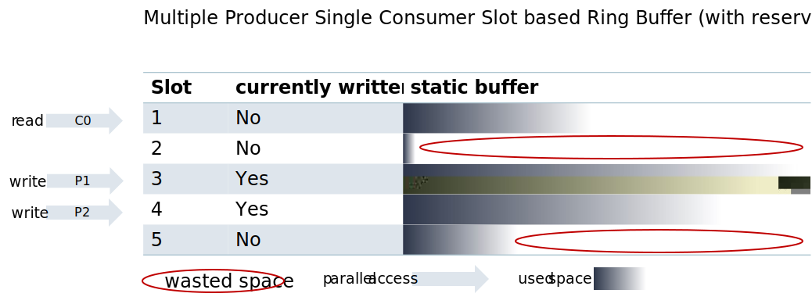

<!--- 
*******************************************************************************>
Copyright (c) 2024 Contributors to the Eclipse Foundation
See the NOTICE file(s) distributed with this work for additional
information regarding copyright ownership.
This program and the accompanying materials are made available under the
terms of the Apache License Version 2.0 which is available at
https://www.apache.org/licenses/LICENSE-2.0
SPDX-License-Identifier: Apache-2.0 #
*******************************************************************************
 ---> 


# Logging

## History and Motivation

We had two different logging implementations. One is the `ara::log` implementation, the other one is
the `lib::logging` one. Unfortunately, `lib::logging` is not a real abstraction of `ara::log` since it exposes its
symbols.

Most of our applications use `ara::log` directly, also in their business logic. The problem arises that
`ara::log` has a strong dependency to `ara::core`. The second problem is that a lot of our current
unit-tests are mocking the Adaptive AUTOSAR Stack. Especially the `ara::com` interfaces. These interfaces also have a
dependency to `ara::core`. Since we don't want to have a dependency to the Supplier middleware communication stack in
our Unit-Tests, we also have a custom implementation of `ara::core`. Due to miss-use (also in transitive dependencies)
we have issues with this situation on a daily basis. For example duplicated symbols of `ara::core` types in tests.

It could be that in future for our use case we may not need the Adaptive AUTOSAR Stack itself. Leading to the
motivation for the `mw`-Abstraction. Logging is an essential part and will be used in any business logic.
Another motivation is to provide a safe logging library to use in an ASIL-B context.

## Introduction

Within this document we are describing an improved way to implement a client logging library. We are especially not
describing how to implement the `ara::log` API, since it will depend on third-party deliveries (e.g. the Supplier stack).

This proposal has few benefits over the older implementation:

- No dependency to `ara::core` and the adaptive AUTOSAR Stack
- Object-Seam way for mocking (no link-time mocking)
- No dynamic memory allocation as end goal (as step in between we will have still _one_ location of dynamic memory
  allocation)
- Faster & more Efficient

Due to the nature of logging we want to support free functions. A Removal of free-functions would lead to a major issue
in all current users and thus is impractical. Also a integration into `ara::log` would not be possible, since the API
clearly forces free functions. Thus, the abstraction is not straight forward and needs to be split into two parts. A not
mockable and a mockable part.

Before going into detail on these two parts, another basic principle shall be agreed on. C++ mainly
uses [streams](https://en.cppreference.com/w/cpp/io) to perform input and output operations. We want to follow this
example to provide a consistent interface for the general C++ user. We understand that there are individuals and even
use-cases where a function-based logging improves the overall situation. It shall be noted that we do not blindly
decline these requests, but in order to optimally use the [DLT protocol](#dlt-formatted-payload) (which is our main
backend), a stream based approach has clear benefits as explained later.

## Design

The main point of our design is based on a slot oriented lock-free ringbuffer, where each slot can be marked as
currently used. This kind of data structure is illustrated in the following graphic.


The goal is to create slots that allow individual writing and reading simultaneously. The reader can determine
whether they can continue or not by checking a flag indicating if the slot has been written to. If each slot is
filled, the writer will - like in a normal ring buffer - wrap around. This data structure includes multiple
ideas that are important in the context of logging.

First, the buffer size (per slot and the number of slots) is allocated at creation time. This will ensure that no
dynamic memory will be allocated during runtime. Which will improve speed as also it fulfills our safety requirements.

Second, it allows multiple writes at the same time, without requiring that the start / stop in a synchronized manner.
This is particularly important for a use case where we have nested log messages.

```
LogError() << "My message:" << func();


int func() {
    LogError() << "My nested message";
    return 1;
}
```

It shall be recognized that even within one thread, one message is started to be written, then we start and finish
another one, only to then finish the former. Locking our global data structure for each _stream_ would lead to a
deadlock.

Third, due to the non locking nature, we can write from multiple threads in parallel into the data structure.

We willingly accept the trade-off of sacrificing space in order to achieve a stable runtime behavior, which
includes being lock-free and not using dynamic memory.

While lock free data structures are not a novel idea, the specific constrains given in this part for this data
structure, could be novel and a further literature research shall be applied.

Nevertheless, starting from this general idea, we separate our static design into the following major four parts:

1. `Formatter`
   We must support different kind of logging formats. The most major one is the [DLT format](</swh/ddad_platform/blob/master/aas/mw/log/README.md#dlt-formatted-payload>).
   Another one is the raw format (no special formatting applied). A future extension with other formats will be easy,
   separating this concern from the others mentioned below.
2. `Backend`
   This represents the place where the system will store the logging messages, send them to other processes, or
   take any other applicable action. The main idea is that someone can ask to reserve a slot, then get the memory
   address of that slot and then again notify that the writing to the slot has been finished. Basically
   the `Backend` abstracts from our data structure that was previously described.
3. `Recorder`
   In any case, the end-user will always expect a combination of `Formatter` and `Backend`. e.g. it does not make sense
   to send raw formatted streams via DLT. But it could make sense to store DLT-formatted messages in a file. So
   a `Recorder` encapsulates a combination of `Formatter` and `Backend` for a user.
4. `LogStream`
   Is the real user facing API. While theoretically it could also makes sense that a user directly access a recorder, it
   makes more sense to provide a RAII pattern from him to easily interact with our API. This is exactly done by our
   `LogStream`. Upon creation, a slot will be reserved and is _owned_ by the `LogStream`. Upon destruction, the
   respective slot will be made available again.

This design allows that any content streamed by the user into a `LogStream`, will directly end up in the respective slot
implementation.


### Types of recorders

Following recorders are supported:
1. DataRouterRecorder - which enables remote logging, which is the most common.
2. TextRecorder - which enables logging to a text based backend (e.g. console, or system backend).
3. FileRecorder - which enables logging to the file.
4. CompositeRecorder - which may combine multiple logging modes mentioned above, what means that enables logging
   to e.g. console and file in parallel.
5. EmptyRecoder - used when logging is off.
Because of the similarity between TextRecorder and FileRecorder it was decided to use the common Backend for both.
The static design of these recorders is presented below.


### Activity diagrams


### DataRouter backend

The detailed design for the Safe Datarouter backend is avaiable [here](./datarouter_backend/README.md)

### Integration with ara::log

The main idea is that `ara::log` will just act as facade for our abstraction. The careful reader will say that this
sentence does not make any sense and that is true. Since we are controlling the `ara::log` implementation, it does not
make sense to create an abstraction for it and thus loos runtime performance. Thus, we will treat our logging
implementation as first-class-citizen and `ara::log` will have the overhead for the facade, even though it might be
quite small (e.g. one addition function call). Apparently `ara::log` will have certain functionalities which are not
supported by our mw-implementation. It will even have Vector-Specific extensions. We accept that and try to keep these
extensions to a minimum to reduce maintaining efforts.


### User-Facing APIs

As mentioned the `LogStream` will be the actual user facing API for streaming content into our buffers. But the creation
of this `LogStream` is a little tricky, since the injection of the correct `Recorder` is required. We don't want to
bother the user in the normal case with this behaviour. Which is why we make the `LogStream` only constructable by our
factory method. The factory method could be invoked by the user, but is in a respective implementation specific
namespace. At the end, the user will be either able to create a `LogStream` via our free-functions (stated in the
beginning of this document), or a context aware logger. At the end it shall be noted, that the ownership of
the `LogStream` is transferred from the middleware to the user, which is why these calls must be performed by value and
not interface is possible at that point in time. This transfer of ownership is important, since otherwise further
dynamic memory allocation would be necessary.

## Library Dependencies

A comprehensive list of library dependencies for mw::log can be queried using bazel via:
`bazel query 'kind("cc_library", deps(//platform/aas/mw/log))'`

Few of the external dependencies include:
- @amp//:amp
- @amp//:math
- @xpad_qnx_sdp//:libsecpol
- @xpad_qnx_sdp//:libslog2
- @ipnext_qnx_sdp//:libsecpol
- @ipnext_qnx_sdp//:libslog2
- @bazel_tools//third_party/def_parser:def_parser_lib
- @bazel_tools//tools/cpp:malloc

## How-Tos

In order to better understand the design we describe different common use-cases for users of the mw::log APIs: See [Usage](/swh/ddad_platform/blob/master/aas/mw/log/README.md#usage)
